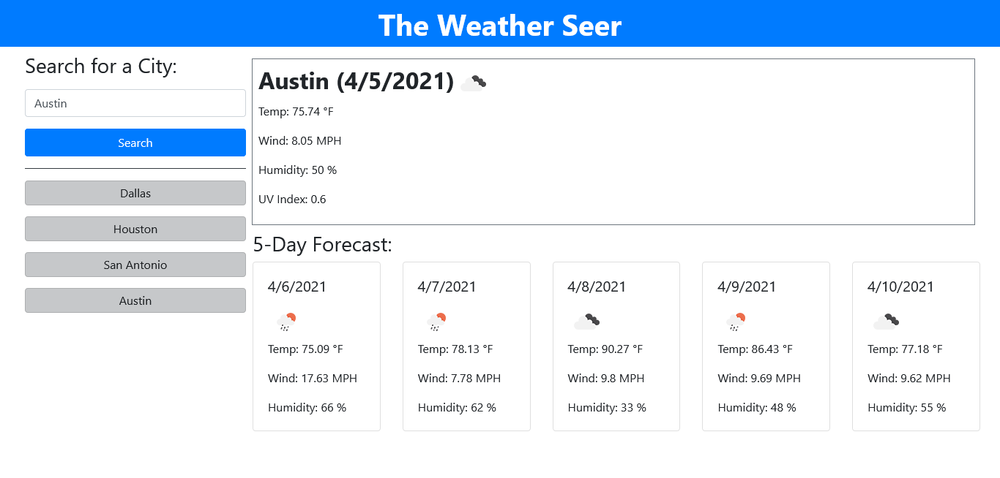
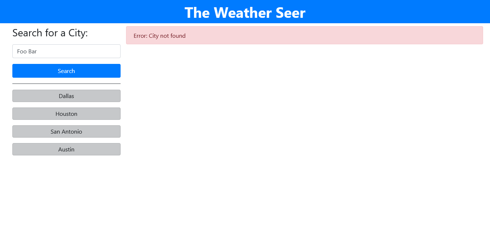

# the-weather-seer

## Description
This project is a weather page which uses the OpenWeather API, the HTML elements are manipulated using jQuery, and the design is provided by Bootstrap. The user can input a city name in the box, and the current weather and 5-day forecast for that city will display. If the user provides a bad input, an error message will display. A successful search will create a button underneath the search box that can be clicked again to load that city's forecast. These searches are saved to local storage, so these buttons will persist upon reloading the page.

## Live Link
https://mattyp1007.github.io/the-weather-seer/

## Screenshots

